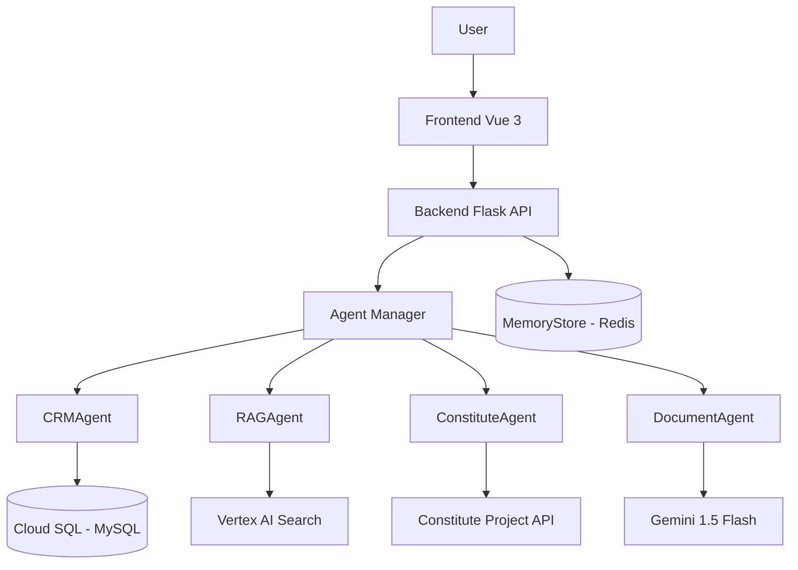

# LegisLink AI 🚀

LegisLink AI is a multi-agent platform for complex legal process automation, built for the Google Cloud ADK Hackathon. It leverages the power of Google's Generative AI models (Gemini) and Vertex AI to provide a suite of tools for legal professionals.

## 🌟 Features

-   **Multi-Agent System**: An orchestrator (`AgentManager`) delegates tasks to specialized agents for CRM, Document Generation, and RAG-based Legal Search.
-   **Conversational UI**: A modern, responsive, and multilingual (English/Spanish) frontend built with Vue 3 and Tailwind CSS.
-   **Database Integration**: Manages clients and cases in a MySQL database, with a tool-based `CRMAgent`.
-   **RAG Pipeline**: Utilizes Vertex AI Search for Retrieval-Augmented Generation on a legal knowledge base.
-   **Constitutional Validation**: Integrates with the Constitute Project API to validate legal text.
-   **Ready for Production**: Containerized with Docker and ready for deployment on Google Cloud Platform.

## 🧱 Architecture

The system consists of the following services:

-   **Frontend**: A Vue.js single-page application that provides the user interface.
-   **Backend**: A Flask (Python) API that serves the frontend and orchestrates the agent system.
-   **Database**: A MySQL database for storing client and case data.
-   **Cache**: A Redis instance for caching and session management.



---

## 💻 Running Locally with Docker

To run the entire platform locally, you need Docker and Docker Compose installed.

**1. Set up Environment:**

   Create a `.env` file inside the `legislink-ai` directory by copying `env.example`.

   ```bash
   cp legislink-ai/env.example legislink-ai/.env
   ```

   Fill in the `.env` file with your actual credentials, especially for Google Cloud and Gemini. For local development, `DB_HOST` should be `db` and `REDIS_HOST` should be `cache`.

**2. Build and Run:**

   From the root directory of the project (`LegisLink/`), run the following command:

   ```bash
   docker-compose up --build
   ```

   -   The frontend will be available at `http://localhost:8080`.
   -   The backend API will be at `http://localhost:5000`.

---

## ☁️ Deploying to Google Cloud Platform (GCP)

This guide assumes you have a GCP project and the `gcloud` CLI installed and authenticated.

**1. Create Cloud SQL (MySQL) Instance:**

   -   Go to the Cloud SQL section in the GCP Console.
   -   Create a new MySQL 8.0 instance.
   -   Give it an instance ID (e.g., `legislink-ai-db-instance`).
   -   Set a strong root password.
   -   Create a database (e.g., `legislink-ai_db`) and a user (e.g., `legislink`).
   -   **Important**: Under "Connections", enable the "Private IP" and make sure the associated VPC network is accessible by Cloud Run.

**2. Create MemoryStore (Redis) Instance:**

   -   Go to the MemoryStore section.
   -   Create a new Redis instance.
   -   Configure it to be accessible from the same VPC network as Cloud Run.

**3. Update `.env` with Cloud Credentials:**

   Update your local `.env` file with the connection details for your new Cloud SQL and MemoryStore instances.

**4. Build and Push Images:**

   The `cloudbuild.yaml` file is configured to build the backend image and push it to Google Artifact Registry.

   ```bash
   # From within the legislink-ai/ directory
   gcloud builds submit --config cloudbuild.yaml .
   ```

   You will also need to build and push the frontend image separately.

   ```bash
   # From within the legislink-ai/frontend/ directory
   gcloud builds submit --tag gcr.io/YOUR_PROJECT_ID/legislink-ai-frontend .
   ```

**5. Deploy to Cloud Run:**

   Deploy the backend service:

   ```bash
   gcloud run deploy legislink-ai-backend \
     --image gcr.io/YOUR_PROJECT_ID/legislink-ai:latest \
     --platform managed \
     --region YOUR_GCP_REGION \
     --allow-unauthenticated \
     --set-env-vars "DB_HOST=/cloudsql/YOUR_PROJECT:REGION:INSTANCE,DB_USER=...,DB_PASSWORD=...,DB_NAME=...,REDIS_HOST=..."
   ```
   *Note: Set all required environment variables using the `--set-env-vars` flag.*

   Deploy the frontend service:
   ```bash
   gcloud run deploy legislink-ai-frontend \
     --image gcr.io/YOUR_PROJECT_ID/legislink-ai-frontend \
     --platform managed \
     --region YOUR_GCP_REGION \
     --allow-unauthenticated
   ```

**6. Access Your Deployed Application:**

   Cloud Run will provide you with public URLs for both the frontend and backend services.

---

## ✅ Project Complete

All tasks from the initial plan have been audited and completed. The platform is functional, containerized, and documented for deployment. 